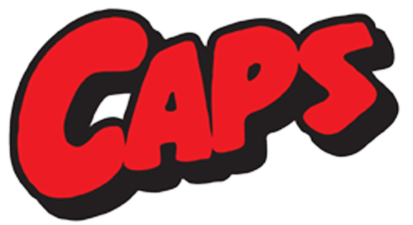

<a name="readme-top"></a>
 
 
<!-- PROJECT LOGO -->
<br />
<div align="center">
   
  <a href="https://github.com/ibrsec/Capsblog-fullstack/tree/main/client">
    
  </a>

  <h3 align="center">Front end of the Full stack Caps Blog App</h3>

  <p align="center">
    An awesome Full stack Caps Blog App
    <!-- <a href="https://github.com/ibrsec/stock-app"><strong>Explore the docs »</strong></a> -->
    <br />
    <br />
    <a href="https://capsblog-fs-express-react.onrender.com">View Demo</a>
    ·
    <a href="https://github.com/ibrsec/Capsblog-fullstack">Backend Repo</a>
    ·
    <a href="https://github.com/ibrsec/Capsblog-fullstack/issues">Report Bug</a>
    ·
    <a href="https://github.com/ibrsec/Capsblog-fullstack/issues">Request Feature</a>
  </p>
</div>


<!-- TABLE OF CONTENTS -->
<details>
  <summary>📎 Table of Contents 📎 </summary>
  <ol>
    <li><a href="#about-the-project">About The Project</a></li>
     <!-- <li><a href="#figma">Figma</a></li> -->
     <li><a href="#overview">Overview</a></li>
     <li><a href="#quick-setup">Quick Setup</a></li>
     <li><a href="#directory-structure">Directory structure</a></li>
     <li><a href="#built-with">Built With</a></li>
    <!-- <li>
      <a href="#getting-started">Getting Started</a>
      <ul>
        <li><a href="#prerequisites">Prerequisites</a></li>
        <li><a href="#installation">Installation</a></li>
      </ul>
    </li>
    <li><a href="#usage">Usage</a></li>
    <li><a href="#roadmap">Roadmap</a></li>
    <li><a href="#contributing">Contributing</a></li>
    <li><a href="#license">License</a></li>
    <li><a href="#contact">Contact</a></li>
    <li><a href="#acknowledgments">Acknowledgments</a></li> -->

    
  </ol>
</details>


---

<!-- ABOUT THE PROJECT -->
<a name="about-the-project"></a>
## ℹ️ About The Project

[](https://capsblog-fs-express-react.onrender.com)


<p align="right">(<a href="#readme-top">back to top</a>)</p>


---

<!-- ## Figma 

<a href="https://www.figma.com/file/ePyCHKsx2ODB32uLgyUEEd/bootstrap-home-page?type=design&node-id=0%3A1&mode=design&t=edDzadCB9Ev5FS1a-1">Figma Link</a>  

  <p align="right">(<a href="#readme-top">back to top</a>)</p>


--- -->
<a name="overview"></a>
## 👀 Overview

📦 Frontend of the my [Capsblog-fullstack](https://github.com/ibrsec/Capsblog-fullstack) project </br></br>
<b>FRONTEND:</b> </br>
<b>🎯 React Development:</b>  Built a responsive and interactive blog interface using React.js to deliver a seamless user experience.

<b>🛠 State Management:</b>  Utilized Redux Toolkit and Persist for managing state and maintaining user sessions efficiently.

<b>🚀 React Router:</b>  Integrated React Router for smooth navigation between blog posts, categories, and user profiles.

<b>🔔 User Notifications:</b>  Implemented real-time notifications using React Toastify to inform users of actions like post creation or comments.

<b>🔍 Search Functionality:</b>  Enabled efficient search functionality for finding posts and filtering by category.

<b>📷 Image Upload:</b>  Supported profile picture and blog post image uploads for enhanced user profiles and content creation.

<b>🎨 UI Design:</b>  Designed a clean and modern UI using Tailwind CSS for responsive and consistent styling.


<p align="right">(<a href="#readme-top">back to top</a>)</p>


<a name="quick-setup"></a>
## 🛫 Quick Setup

```sh
# clone the project
git clone https://github.com/ibrsec/Capsblog-fullstack.git

# enter the project directory
cd Capsblog-fullstack

# install dependency
# linux
npm run setup-production
# windows
npm run setup-production-windows

# run
node index.js

```

<p align="right">(<a href="#readme-top">back to top</a>)</p>


<!-- ## 🐞 Debug

 -->


<a name="directory-structure"></a>
## 📂 Directory structure 

```diff
+ Capsblog-fullstack/client  (folder)   
        |---public (folder) 
        |                
+       |---src (folder) 
        |     |---pages (folder)       
        |     |           
        |     |---components (folder) 
        |     |    
        |     |---app (folder) ---store.jsx            
        |     |    └---features (folder)(slices)     
        |     |          
        |     |---features (folder)(slices)        
        |     |          
        |     |---router (folder)         
        |     |          
        |     |---services (folder)              
        |     |          
        |     |---helper (folder)          
        |     |          
        |     |---App.js 
        |     |---Index.js
        |     └---Index.css
        |      
        |----package.json 
        |----tailwind.config.js 
        └----readme.md 
        
```

<p align="right">(<a href="#readme-top">back to top</a>)</p>

---

<a name="built-with"></a>
### 🏗️ Built With

 
<!-- https://dev.to/envoy_/150-badges-for-github-pnk  search skills-->


 
  
  
 <!--   -->
 <!--   -->
 <!--   -->
  
  

  
  
  
 <!--   -->


  
  

 <!--   -->
 <!--   -->
 <!--   -->
  
  
 
